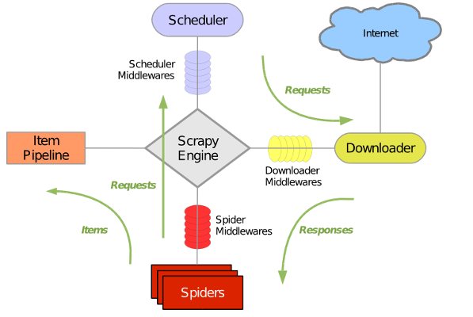

# WebCrawler 网络爬虫

---

# WARNING
  如果你想将该技术用于实战，强烈建议你先阅读[《中华人民共和国网络安全法》](http://www.cac.gov.cn/2016-11/07/c_1119867116.htm)，保证你的老板不被送进监狱
  
  《网络安全法》以及最新刑事司法解释：

- 未经授权爬取用户手机通讯录超过50条记录，老板进去最高可达3年；
- 未经授权抓取用户淘宝交易记录超过500条的，老板进去最高可达3年
- 未经授权读取用户运营商网站通话记录超过500条以上的，老板进去最高可达7年；
- 未经授权读取用户公积金社保记录超过50000条的，老板进去最高可达7年。

---

#  1. 爬虫的定义
- 按照一定规则，自动获取网络信息的程序
- 别名：网络机器人、网页蜘蛛、网页追逐者
- [魔力小视频](https://jeff1992.github.io/WebCrawler/static/show.mp4)

--- 

# 2. 爬虫的起源
- 搜索引擎

    所有搜索引擎的祖先，是1990年由Montreal的McGill University学生Alan Emtage、Peter Deutsch、Bill Wheelan发明的Archie(Archie FAQ)。当时World Wide Web还未出现。Archie是第一个自动索引互联网上匿名FTP网站文件的程序，但它还不是真正的搜索引擎。Archie是一个可搜索的FTP文件名列表，用户必须输入精确的文件名搜索，然后Archie会告诉用户哪一个FTP地址可以下载该文件。
    
    类似百度谷歌这样的搜索引擎，其核心逻辑，就是爬虫7*24不停爬取互联网的资源保存在自己的服务器上，通过用户的搜索关键字进行匹配并返回对应的结果。
    
---

# 3. 基本工作原理

---

# 4. 爬虫现状
>互联网至少50%的流量都来自于爬虫

---

## 4.1. 行业分布

- 出行：火车票、机票、共享单车、酒店
- 社交：微博  
- 电商：比价平台、聚合电商、返利平台
- O2O：点评、外卖、团购
- 公共行政：法院文书、知识产权、企业信息、挂号平台
- 运营商：刷靓号、抢号、代购
- 自媒体：订阅号、短视频
- 地图：商户信息
- SEO：影响搜索引擎排名
- 其他：新闻、招聘、问答、百科、物流、分类信息、小说等

---

## 4.2. 流量分布
序号|公司|域名|流量占比
---|:--:|:--:|---:
1|中国铁路客户服务中心|12306.cn|18.65%
2|微博|weibo.cn|18.05%
3|淘宝|taobao.com|12.16%
4|百度|baidu.com|6.22%
5|大众点评|dianping.com|6.14%
6|联通|10010.com|4.82%
7|微信搜索|weixin.sogou.com|2.85%
8|最高人民法院公告查询|court.gov.cn|2.78%
9|腾讯|qq.com|2.24%
10|Google|google.com|2.10%
11|新浪|sina.com.cn|1.45%
12|亚洲航空|airasia.com|1.22%
13|智联招聘|zhaopin.com|1.02%
14|360搜索|360.cn|0.79%
15|北京市预约挂号统一平台|bjguahao.gov.cn|0.74%
16|搜狗|sogou.com|0.55%
17|京东|jd.com|0.58%
18|搜狐|sohu.com|0.55%
19|高德地图|amap.com|0.50%
20|国家知识产权局|sipo.gov.com|0.48%

----

# 5. 爬虫分类
  根据使用场景，网络爬虫可分为 通用爬虫 和 聚焦爬虫 两种.

---

## 5.1. 通用爬虫
### 工作流程
  - 抓取网页
  - 数据存储
  - 预处理
  - 提供检索服务，网站排名
### 局限性
  - 通用搜索引擎所返回的结果都是网页，而大多情况下，网页里90%的内容对用户来说都是无用的。
  - 不同领域、不同背景的用户往往具有不同的检索目的和需求，搜索引擎无法提供针对具体某个用户的搜索结果。
  - 万维网数据形式的丰富和网络技术的不断发展，图片、数据库、音频、视频多媒体等不同数据大量出现，通用搜索引擎对这些文件无能为力，不能很好地发现和获取。
  - 通用搜索引擎大多提供基于关键字的检索，难以支持根据语义信息提出的查询，无法准确理解用户的具体需求。

---

## 5.2. 聚焦爬虫

  聚焦爬虫，是"面向特定主题需求"的一种网络爬虫程序，它与通用搜索引擎爬虫的区别在于： 聚焦爬虫在实施网页抓取时会对内容进行处理筛选，尽量保证只抓取与需求相关的信息。

---

# 6. 爬虫实现方式
  爬虫的几种实现方式：

  - 爬虫平台配置式开发

    不会写代码？在爬虫平台点点鼠标就能创建一个爬虫任务，适用于基本不懂技术，搞运营的人。

  - 爬虫平台少量代码开发

    懂一些JS脚本，在第三方平台爬虫平台上写少量代码就可以完成爬虫。

  - 完全自己写代码开发

    有Python/C#/Java等一门熟练的语言，可以自己从零写一个爬虫，或者利用开源的爬虫框架。

---
# 7. 设计几个爬虫试试
## 7.1. 爬虫平台配置式开发
- [八爪鱼](https://www.bazhuayu.com/)

    示例：爬一下[广东药监局二类医疗的厂家](http://219.135.157.143:2002/gzwz/gdyj/sjwz/Main.faces?menuId=1&amp;navId=1)

## 7.2. 爬虫平台少量代码开发
- [神箭手云](https://www.shenjian.io/)

---

## 7.3. 直接上代码，本地开发
- 不用任何爬虫框架

    示例：用nodejs爬 [国内新闻](https://news.sina.com.cn/china/)

- 使用爬虫框架
    
    Python [Scrapy](https://scrapy.org/)

    DotNet [DotnetSpider](https://github.com/dotnetcore/DotnetSpider/)

---

### Scrapy 框架

  

-  引擎(Scrapy):

    用来处理整个系统的数据流, 触发事务(框架核心)

---

### Scrapy 框架

-  调度器(Scheduler)

    用来接受引擎发过来的请求, 压入队列中, 并在引擎再次请求的时候返回. 可以想像成一个URL（抓取网页的网址或者说是链接）的优先队列, 由它来决定下一个要抓取的网址是什么, 同时去除重复的网址

- 下载器(Downloader)

    用于下载网页内容, 并将网页内容返回给蜘蛛(Scrapy下载器是建立在twisted这个高效的异步模型上的)

- 爬虫(Spiders)

    爬虫是主要干活的, 用于从特定的网页中提取自己需要的信息, 即所谓的实体(Item)。用户也可以从中提取出链接,让Scrapy继续抓取下一个页面

---

### Scrapy 框架

- 项目管道(Pipeline)

    负责处理爬虫从网页中抽取的实体，主要的功能是持久化实体、验证实体的有效性、清除不需要的信息。当页面被爬虫解析后，将被发送到项目管道，并经过几个特定的次序处理数据。

- 下载器中间件(Downloader Middlewares)

    位于Scrapy引擎和下载器之间的框架，主要是处理Scrapy引擎与下载器之间的请求及响应。

- 爬虫中间件(Spider Middlewares)

    介于Scrapy引擎和爬虫之间的框架，主要工作是处理蜘蛛的响应输入和请求输出。

- 调度中间件(Scheduler Middewares)

    介于Scrapy引擎和调度之间的中间件，从Scrapy引擎发送到调度的请求和响应。

---

### DotnetSpider 框架图

  

---

# 8. 爬虫与反爬虫大战

>爬虫是小公司的命脉，反爬虫是大公司的命脉

## 如何反爬虫
- 君子协定：robots.txt
- 校验User-Agent（用户所使用的浏览器）
- 图片验证码
- 为请求增加签名
- IP黑名单
- 短信验证码
- 人脸识别
- 视频读数

---

# 9. 爬虫相关产业链
## 9.1 代理提供商
- 海量IP
## 9.2 VPN提供商
## 9.3 拨号VPS提供商
  - 动态IP，每次拨号都不一样
## 9.4 验证码打码平台
  - 自动识别
  - 手动打码
## 9.5 短信接码平台
  - 猫池
  - 卡商

---

# 10. 怎么保护自己的隐私
- 复杂的密码
- 不定期更换密码
- 不要随意在网上留下自己的隐私信息
- 上传证件照时加上水印，表明用途

---

# 最后
## 感谢本次分享会用到的相关技术/资源
- Landslide

    一个可以通过Markdown生成HTML PPT的Python工具，本PPT就是用这个生成的，对于内容型的分享来说是个不错的选择。

- Git Pages

    没有服务器？不怕，把你的网站上传到github仓库里，创建Git Pages并发布，大家就可以用username.github.io/xxx访问你网站了，需要注意的是，只支持纯前端应用哦。